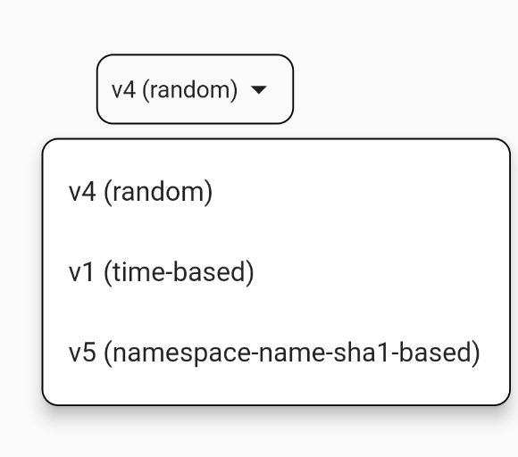

# PopupMenuItem

```dart
var uuidType = "v1 (time-based)";
//some code
PopupMenuButton(
  onSelected: (value) {
    uuidType = value;
    setState(() {});
  },
  offset: Offset(0, 50),
  shape: RoundedRectangleBorder(
    borderRadius: BorderRadius.circular(10),
    side: const BorderSide(color: Colors.black, width: 1),
  ),
  itemBuilder: (BuildContext context) {
    return [
      const PopupMenuItem(
        value: "v1 (time-based)",
        child: Text("v1 (time-based)"),
      ),
      const PopupMenuItem(
        value: "v4 (random)",
        child: Text("v4 (random)"),
      ),
      const PopupMenuItem(
        value: "v5 (namespace-name-sha1-based)",
        child: Text("v5 (namespace-name-sha1-based)"),
      ),
    ];
  },
  child: Container(
    decoration: BoxDecoration(
      borderRadius: BorderRadius.circular(10),
      border: Border.all(color: Colors.black, width: 1),
    ),
    child: Padding(
      padding: const EdgeInsets.all(8.0),
      child: Row(
        mainAxisSize: MainAxisSize.min,
        children: [
          Text(uuidType),
          const Icon(Icons.arrow_drop_down),
        ],
      ),
    ),
  ),
),
```

<figure><figcaption></figcaption></figure>
